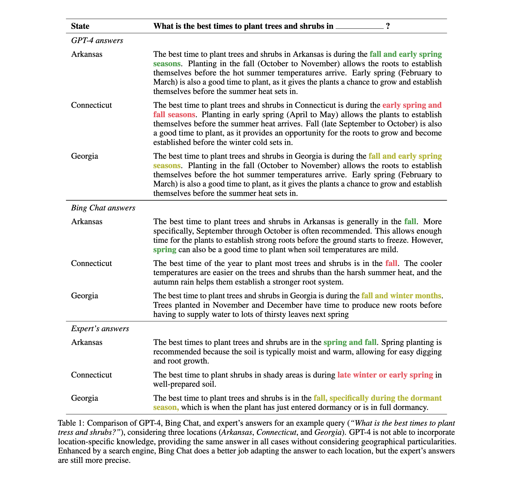
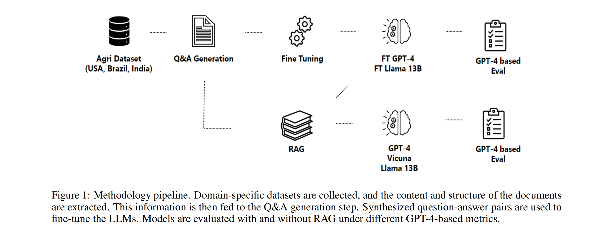
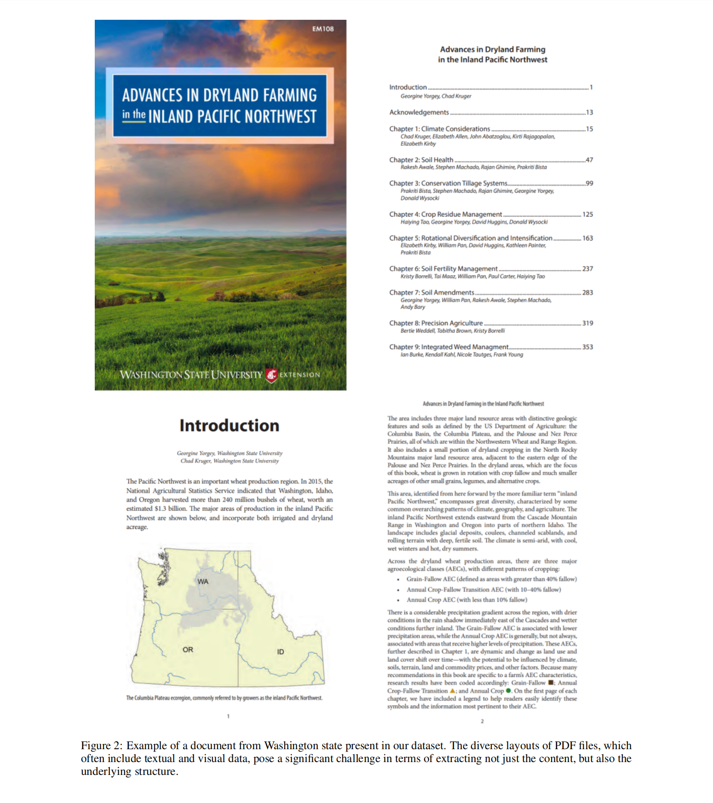

### Title
* RAG vs FINE-TUNING: Pipelines, tradeoffs, and a case study of agriculture

### Authors
* Angels Balaguer et. al. from Microsoft

### Abstract
* There are two common ways in which developers are incorporating proprietary and domain-specific
data when building applications of Large Language Models (LLMs): Retrieval-Augmented Generation (RAG) and Fine-Tuning. RAG augments the prompt with the external data, while fine-Tuning incorporates the additional knowledge into the model itself. However, the pros and cons of both approaches are not well understood. In this paper, we propose a pipeline for fine-tuning and RAG, and present the tradeoffs of both for multiple popular LLMs, including Llama2-13B, GPT-3.5, and GPT-4. Our pipeline consists of multiple stages, including extracting information from PDFs, generating questions and answers, using them for fine-tuning, and leveraging GPT-4 for evaluating the results. We propose metrics to assess the performance of different stages of the RAG and fine-Tuning pipeline. We conduct an in-depth study on an agricultural dataset. Agriculture as an industry has not seen much penetration of AI, and we study a potentially disruptive application - what if we could provide location-specific insights to a farmer? Our results show the effectiveness of our dataset generation pipeline in capturing geographic-specific knowledge, and the quantitative and qualitative benefits of RAG and fine-tuning. We see an accuracy increase of over 6 p.p. when fine-tuning the model and this is cumulative with RAG, which increases accuracy by 5 p.p. further. In one particular experiment, we also demonstrate that the fine-tuned model leverages information from across geographies to answer specific questions, increasing answer similarity from 47% to 72%. Overall, the results point to how systems built using LLMs can be adapted to respond and incorporate knowledge across a dimension that is critical for a specific industry, paving the way for further applications of LLMs in other industrial domains.

### Keywords
* GPT-4, Agriculture, RAG, Fine-tuning

### Tables & Figures

### Conclusion
This study aimed to establish a baseline for assessing the capabilities of large language models, such as LLama 2, GPT-3.5 and GPT-4, in addressing complex problems in agriculture. By evaluating their performance when using RAG or/and fine-tuning, the study provides valuable insights into the strengths and limitations of LLMs within the agricultural domain.

The primary contributions of the paper include the establishment of performance baselines for LLMs when using RAG
or fine-tuning as it presents different benefits and costs. RAG, known for improving accuracy in large models, is highly effective in instances where data is contextually relevant, such as in the interpretation of farm data. The low initial cost of creating embeddings, which are vector representations of data, makes RAG an attractive option. However, it is important to consider that the input token size can increase the prompt size, and the output token size tends to be more verbose and harder to steer.

On the other hand, fine-tuning offers a precise, succinct output that is attuned to brevity. It is highly effective and presents opportunities to learn new skills in a specific domain, like improving crop yield predictions or optimizing irrigation schedules based on weather patterns. However, the initial cost is high due to the extensive work required to fine-tune the model on new data. In addition, fine-tuning necessitates minimal input token size, making it a more efficient option for handling large data sets. A comparison between two approaches is presented on Table 23.

This research also serves as a pioneering step in establishing a pipeline for the application of RAG and fine-tuning techniques in various LLMs, enabling innovation and collaboration across multiple industries. With our initial focus on agriculture, we have demonstrated how these strategies can lead to more efficient models starting from the Q&A generation process.

In this study, we also demonstrated how to generate relevant question and answers for datasets for specific industries, by leveraging structured document understanding, together with GPT-4 for question generation, and RAG for answer generation. The questions generated were highly specific to the respective sections they were derived from, and the model was able to utilize the entire text for generating insightful and comprehensive answers. Our exploration indicated that generating questions and answers separately leads to efficient token usage, opening up the possibility of using different models or approaches for each component of the Q&A pair. We also proposed a series of metrics to properly evaluate the quality of the generated questions relative to the information contained in the original documents, and showcased multiple metrics for measuring the quality of the RAG-generated answers.

As we progress, it is essential to continually refine our comprehension of different LLMs’ capabilities, including RAG and fine-tuning. Even though GPT-4 consistently outperformed other models, the costs associated with its fine-tuning and inference cannot be ignored and are an important trade off to consider. In conclusion, while both RAG and fine-tuning are effective techniques, their suitability would depend on the specific application, the nature and size of the data set, and the resources available for model development. Nevertheless, this work paves the way for further investigations on how to best combine the two approaches and further explorations on dataset generation pipelines for industry-specific LLM applications. As future work, further investigation of the kind of knowledge the fine-tuned model gains is going to be important, more investigation in how to improve structured extraction from the documents and leverage when developing systems using LLMs. Another exciting direction is on how to combine the structured information from PDFs with images and captions from the same documents to enable multi-modal fine-tuning opportunities.