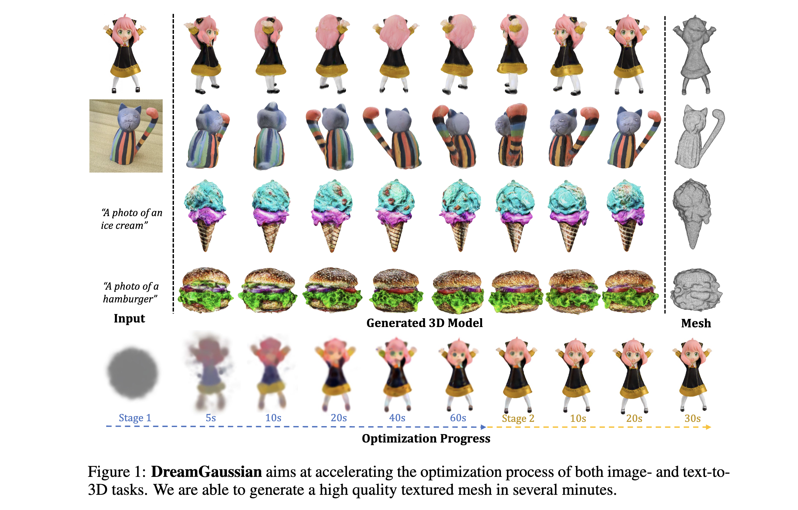

### Title
* DreamGaussian: Generative Gaussian Splatting for Efficient 3D Content Creation
* ICLR 2024 (Oral)

### Authors
* Jiaxiang Tang et. al. from Peking U

### Abstract
* Recent advances in 3D content creation mostly leverage optimization-based 3D generation via score distillation sampling (SDS). Though promising results have been exhibited, these methods often suffer from slow per-sample optimization, limiting their practical usage. In this paper, we propose DreamGaussian, a novel 3D content generation framework that achieves both efficiency and quality simultaneously. Our key insight is to design a generative 3D Gaussian Splatting model with companioned mesh extraction and texture refinement in UV space. In contrast to the occupancy pruning used in Neural Radiance Fields, we demonstrate that the progressive densification of 3D Gaussians converges significantly faster for 3D generative tasks. To further enhance the texture quality and facilitate downstream applications, we introduce an efficient algorithm to convert 3D Gaussians into textured meshes and apply a fine-tuning stage to refine the details. Extensive experiments demonstrate the superior efficiency and competitive generation quality of our proposed approach. Notably, DreamGaussian produces high-quality textured meshes in just 2 minutes from a single-view image, achieving approximately 10 times acceleration compared to existing methods.

### Keywords
* Image-to-3D

### Tables & Figures
* 

### Limitations & Conclusion
* In this work, we present DreamGausssion, a 3D content generation framework that significantly
improves the efficiency of 3D content creation. The key features of our work are: 1) We design the
generative Gaussian splatting pipeline which is highly efficient for 3D generation. 2) We propose a
mesh extraction algorithm that effectively derives textured meshes from 3D Gaussians. 3) With our
texture fine-tuning stage, our work can produce ready-to-use 3D assets with high-quality polygonal
meshes from either a single image or text description within a few minutes.