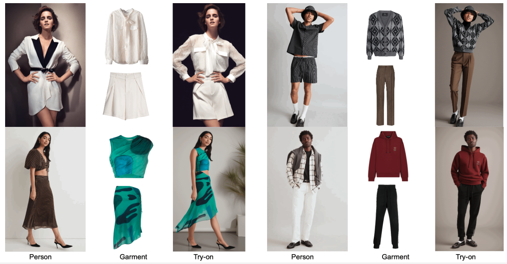
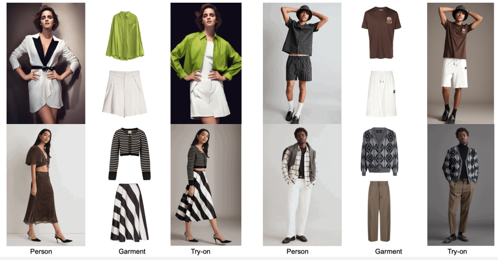
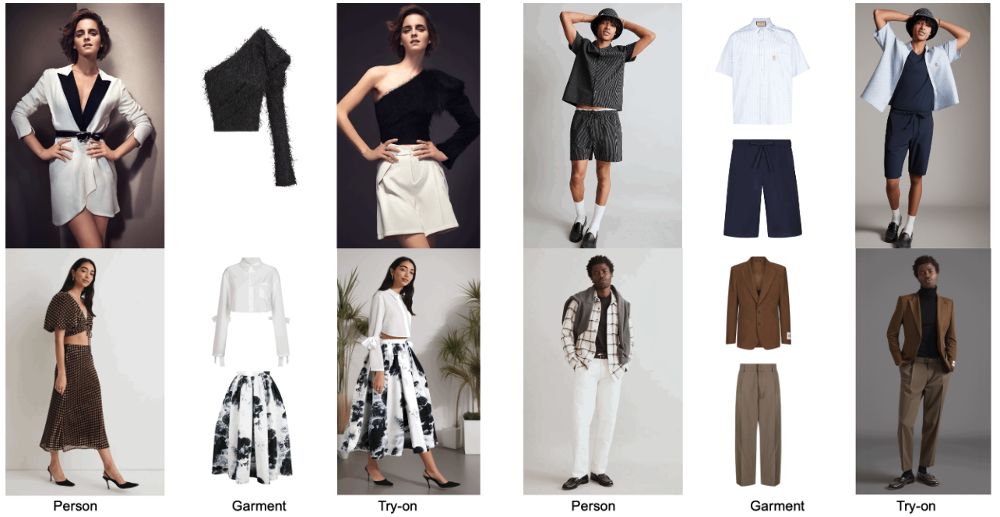
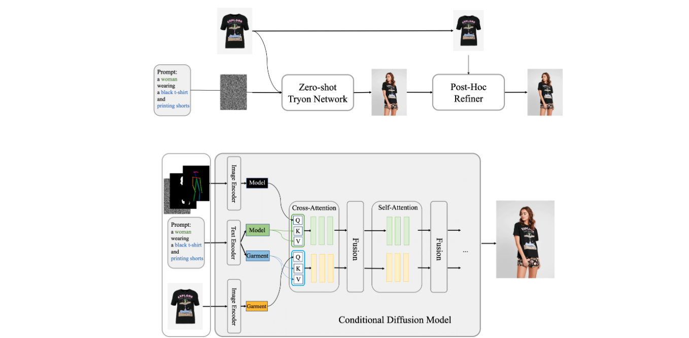
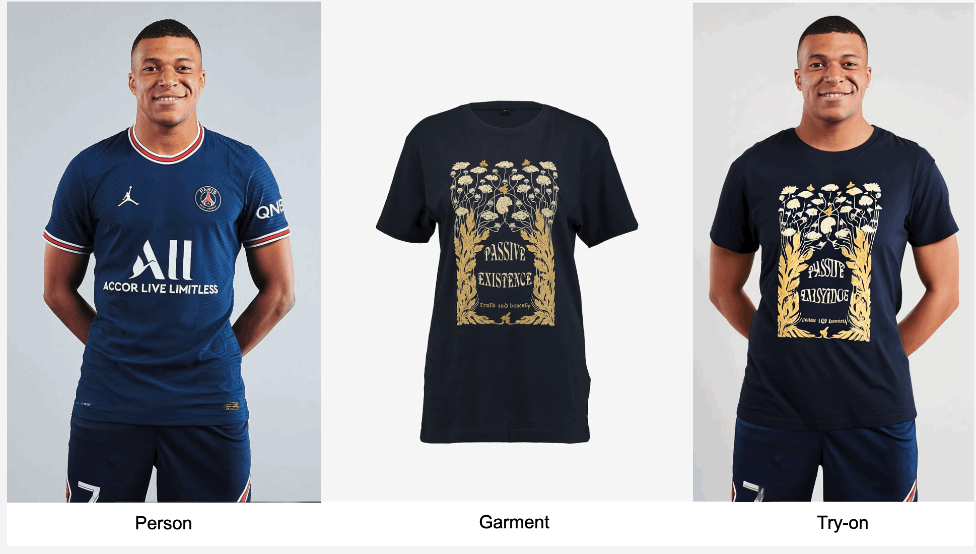
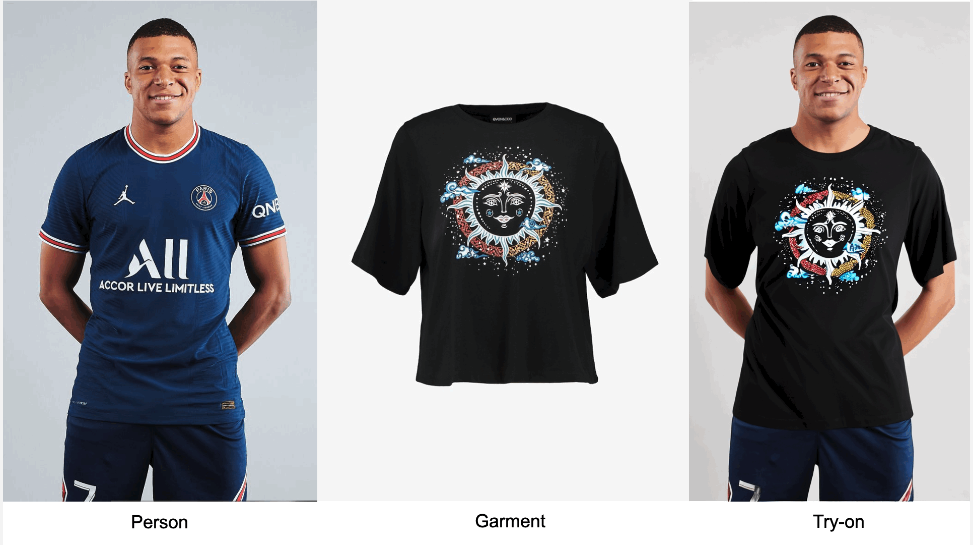
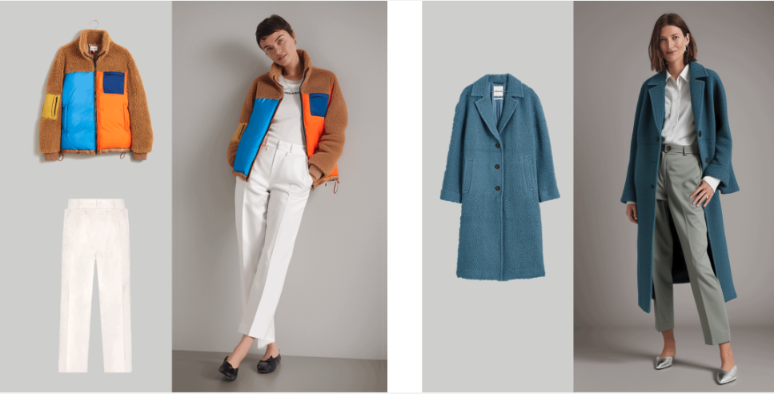
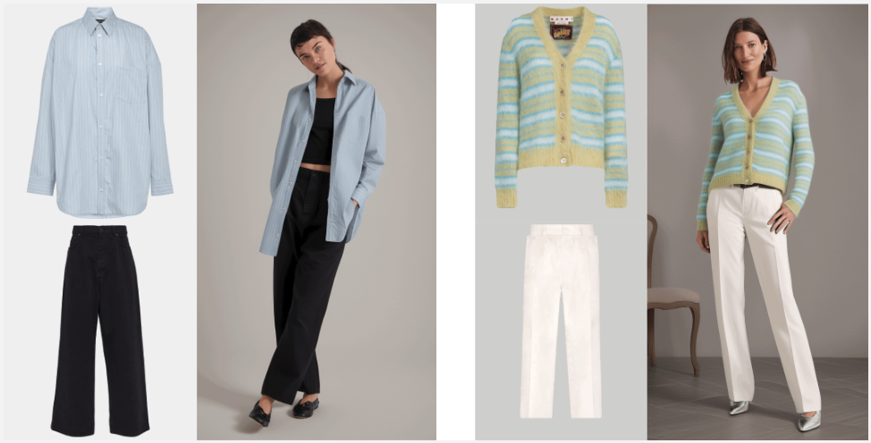
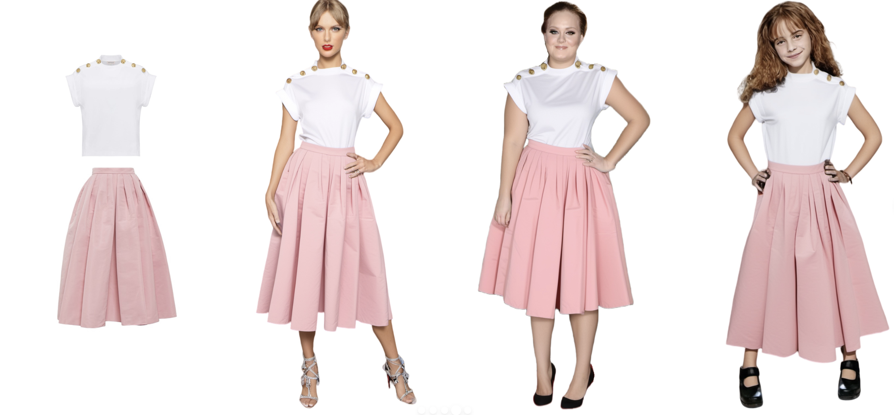
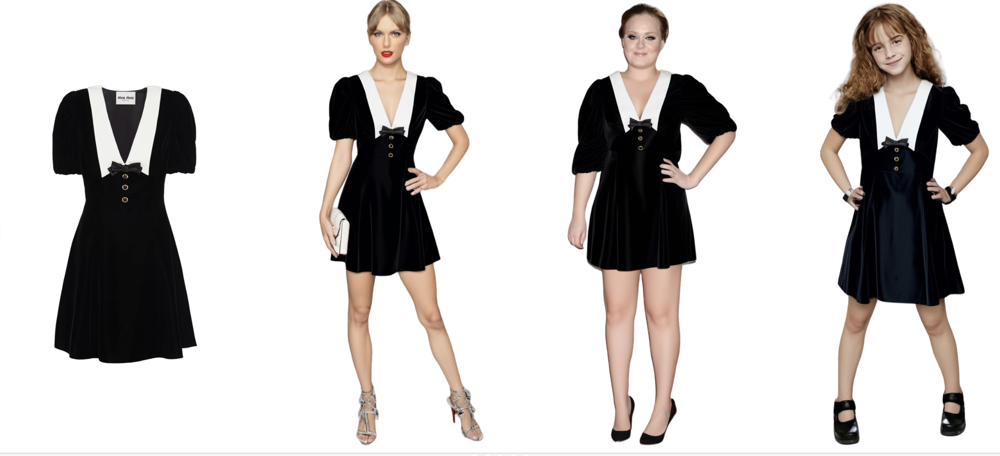

# 新服务
* （2024年火热内测中！）
* 出图：满足时尚业务中出模特图（虚拟试衣），设计图（服装设计）及配色图（美感及外观设计）等需求；

## 超高质量虚拟试衣服务（出模特图）
### 服务简介
Virtual try-on has become a transformative technology, empowering users to experiment with fashion without ever having to physically try on clothing. However, existing methods often struggle with generating high-fidelity and detail-consistent results. Diffusion models have demonstrated their ability to generate high-quality and photorealistic images, but when it comes to conditional generation scenarios like virtual try-ons, they still face challenges in achieving control and consistency. Outfit Anyone addresses these limitations by leveraging a two-stream conditional diffusion model, enabling it to adaptly handle garment deformation for more lifelike results. It distinguishes itself with scalability—modulating factors such as pose and body shape—and broad applicability, extending from anime to in-the-wild images. Outfit Anyone's performance in diverse scenarios underscores its utility and readiness for real-world deployment.

### 效果图

* 效果图1

* 效果图2

* 效果图3

### 核心技术

* The conditional Diffusion Model central to our approach processes images of the model, garments, and accompanying text prompts, using garment images as the control factor. Internally, the network segregates into two streams for independent processing of model and garment data. These streams converge within a fusion network that facilitates the embedding of garment details onto the model's feature representation. On this foundation, we have established our core try-on tech, comprising two key elements: the Zero-shot Try-on Network for initial try-on imagery, and the Post-hoc Refiner for detailed enhancement of clothing and skin texture in the output images.

### Individual Garment

### Outfit

### Various Body Shapes

