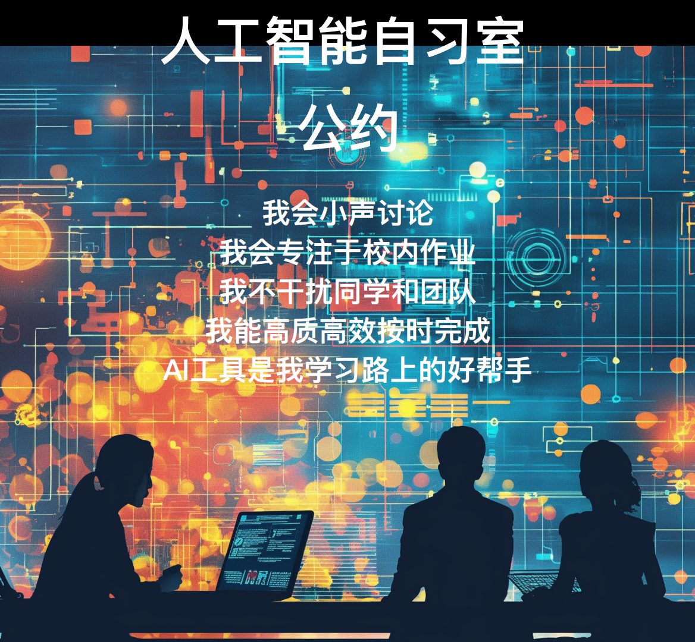
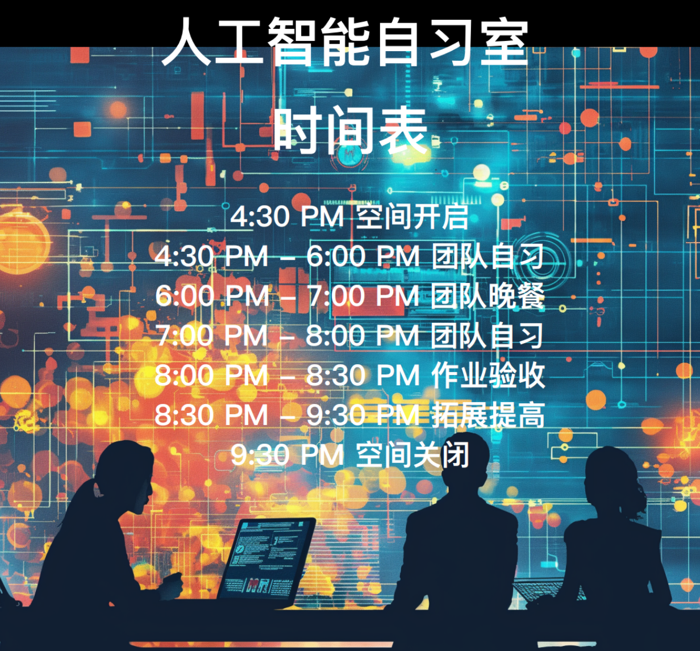
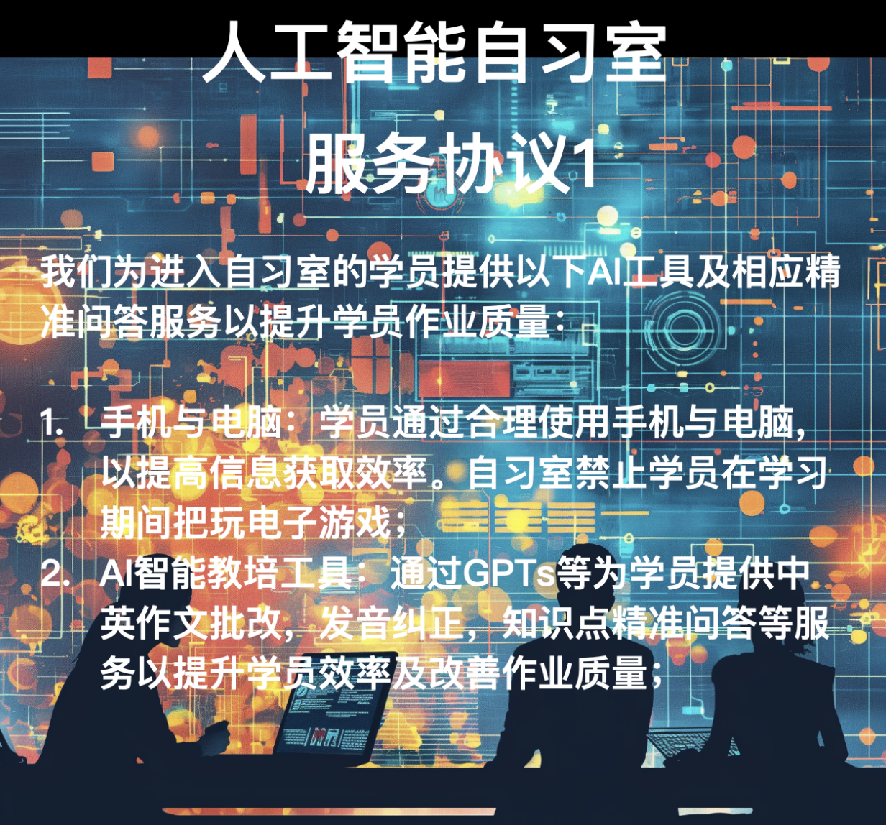
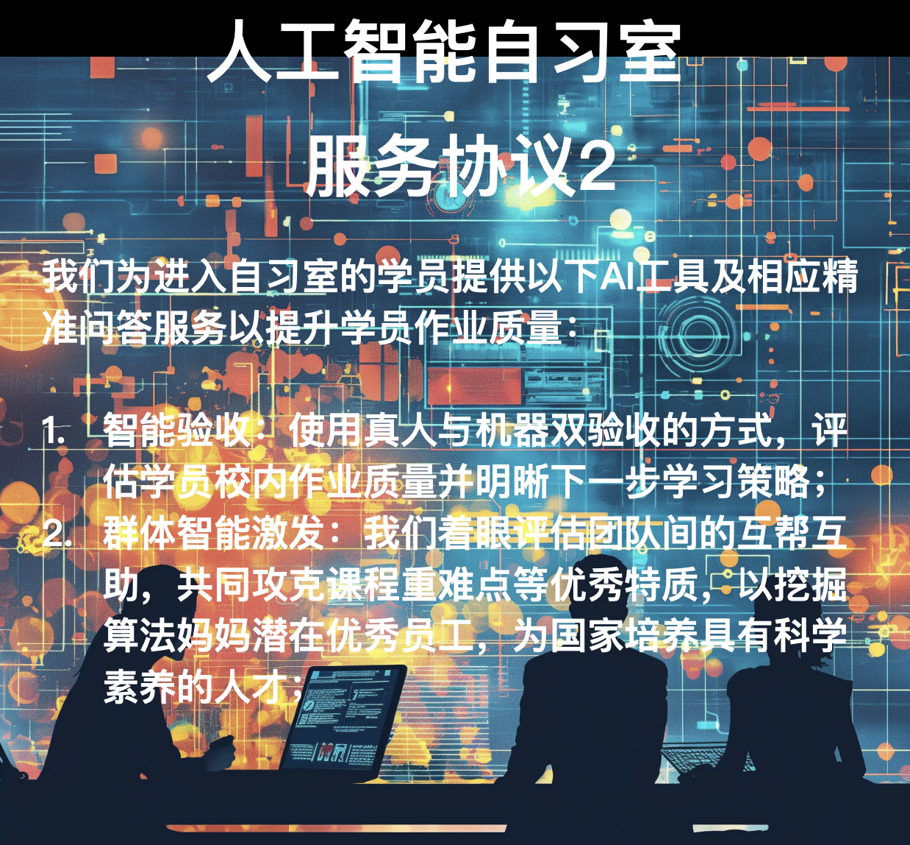
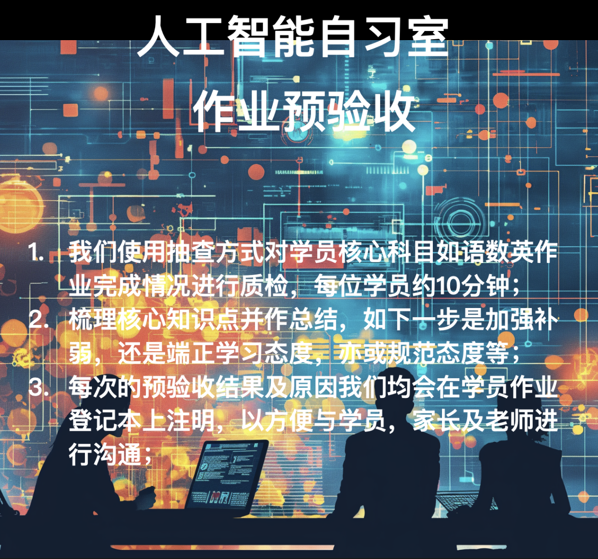
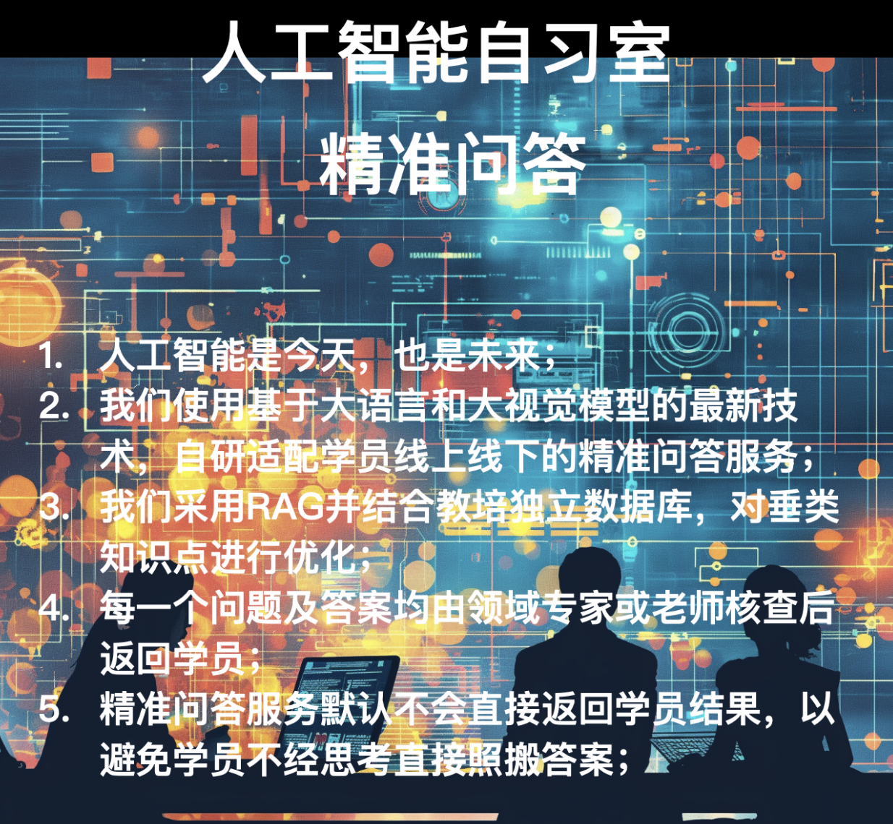

# 人工智能自习室
## 欢迎您

## 简介
* 通过使用AI工具与专家老师相结合赋能线上线下空间学员，对时间进行科学管理，在规定时间内系统性完成复习，作业书写及预习等核心步骤，以形成良好学习闭环。

## 公约

## 时间表

## 服务协议1

## 服务协议2

## 作业预验收

## 精准问答

## 学员风采 & 图册

* 每天都有团队晚餐欢聚时刻

* 每天都有团队与AI工具帮助大家高效高质完成作业

## AI工具
* [语文作文辅导曾老师](https://www.algmon.com/docs/gpts/chinese)
* [数学方程辅导黄老师](https://www.algmon.com/docs/gpts/math)
* [英语语法辅导陈老师](https://www.algmon.com/docs/gpts/math)

## 咨询及报名

* 请添加小玲教务长微信以了解更多

## 校区地址
* 北京路校区：广州市越秀区麦栏街20号