# 买手店 Multibrand Boutique
## 关键洞察
* Mix-and-Match是现代买手店核心竞争力，我们使用AIGC赋能服装行业；
* 疫情暴发加快了消费者从线下往线上迁移的步伐，但这并不意味着线下实体的消亡。相反，物理和情感意义上的体验和驻留将变得尤为可贵；
* 设计师，品牌及买手三者共同勾勒现代商业核心轮廓；

## 时尚趋势现状
### Segment 1: Global Economy
1. Fragmented Future
2. Climate Urgency

### Segment 2: Consumer Shifts
1. Vacation Mode
2. The New Face of Influence
3. Outdoor Reinvented

### Segment 3: Fashion System
1. Gen AI's Creative Crossroad
2. Fast Fashion's Power Plays
3. All Eyes on Brand
4. Sustainability Rules
5. Bullwhip Snaps Back

## 买手店定义
* 买手店是指以目标顾客独特的时尚观念和趣味为基准，挑选不同品牌的时装、饰品等商品融合在一起的店面。是一种欧洲人发明的商业模式，也被称为买手式经营。

## 买手店数量
* 2020年后，中国买手店进入爆发期，据时堂统计，2019年第二季度全国共有3101家买手店，与第一季相比增长了51%，市场规模为72.1亿元。根据Ontimeshow的2022SS订货会数据，该季度成交总额估测超过40亿元，到场的买手顾客高达9603人。买手店的城市分布也从北京、上海等一线城市向二三线城市扩散。

## 买手店成功关键因素
* 初心与保持持久专注；
* 资深时尚买手作为主理人，拥有旗帜鲜明的时尚风格；
* 平衡全球化视野和本地时尚发展趋势；
* 经重构和优化的线上线下一体化销售；
* 积极拥抱AIGC；

## 全球典型买手店
### 北京 Common Place

* designer brand included: Walter Van Beirendonck, Boris Bidjan Saberi and Marc Le Bihan
* 主理人：Ji Zhang & Cheng Huang
* ins: 
* website: 

### 北京 Anchoret
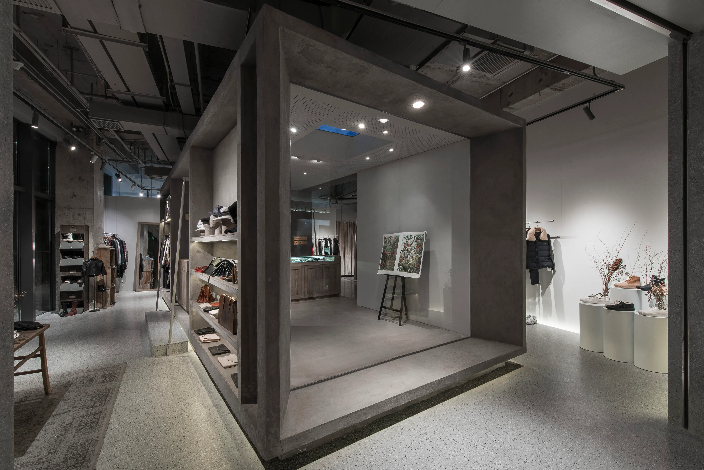
* designer brand included: Ziggy Chen, John Alexander Skelton, Peter Do, Hed Mayner and Paul Harnden Shoemakers
* 主理人：Nicky Chau
* ins: 
* website: 

### 上海 Machine-A
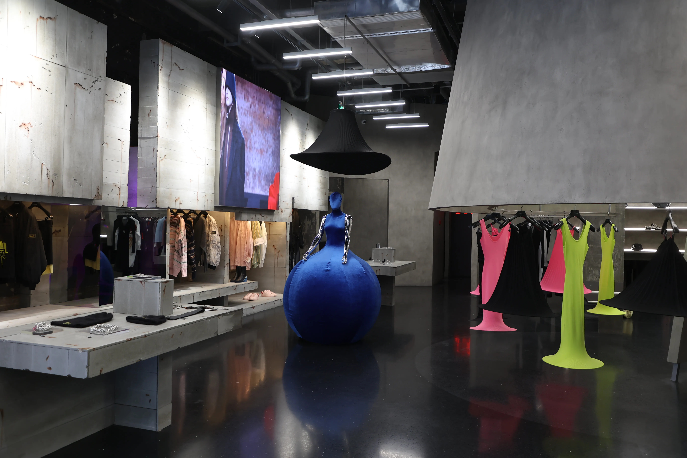
* designer brand included: Bad Binch Tongtong
* ins: 
* website: 

### 上海 MONDE de SHC（LMDS）
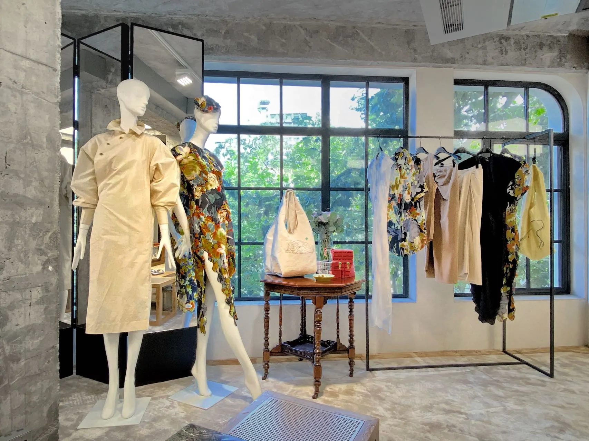
* designer brand included: 16Arlington, Seekings, Holiday Boileau
* 主理人：杨啸

### 杭州 B1ock
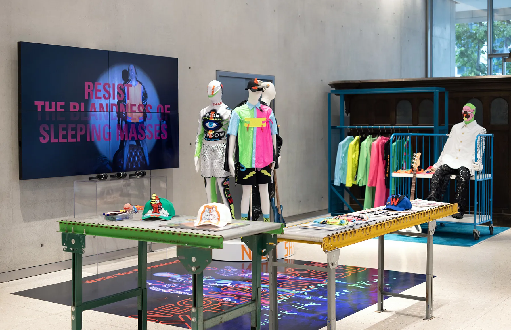
* designer brand included: JNBY, Maison Margiela, Marni, Thom Browne, Marc Le Bihan, Guidi, Rick Owens and Walter Van Beirendonck
* 主理人：

### 深圳 Banmen
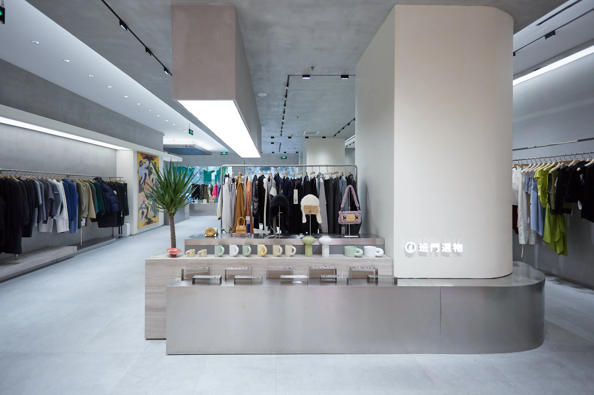
* designer brand included: Roaringwild, 
* 主理人：

### 广州 AI原优舍
* 主理人：张优玲

### 成都 Hug

* designer brand included: Jil Sander, Uma Wang, Jacquemus, Kiko Kostadinov, Sunnei and Toga

### 纽约 Opening Ceremony
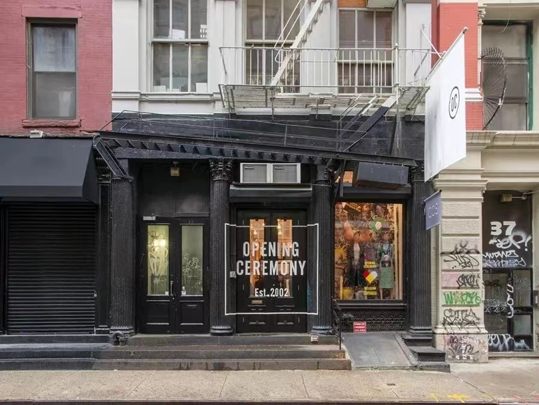
* 纽约 Opening Ceremony，包含设计师品牌如Alexander Wang, Proenza Schouler, Rodarte等
* https://www.instagram.com/openingceremony
* https://www.openingceremony.com

### Dover Street Market
* 主理人：川久保玲
* 品牌：CDG, BALENCIAGA, MIU MIU et. al.

### 巴黎 Colette
* 主理人：

### 伦敦 Browns
* 主理人：

### 洛杉矶 H.Lorenzo
* 主理人：

## 失败案例分析
### 1. 上海 10 Corso Como
#### 失败原因
1. 选址问题
2. 管理不善
3. 公司决策
4. 竞争压力
5. 选品不够中国

### 2. 北京 Joyce
#### 失败原因
1. 来自线上低价买家的竞争

## 成功案例分析
### 1. Dover Street Market
#### 成功原因 1 - 全球化布局

* Beijing 门店

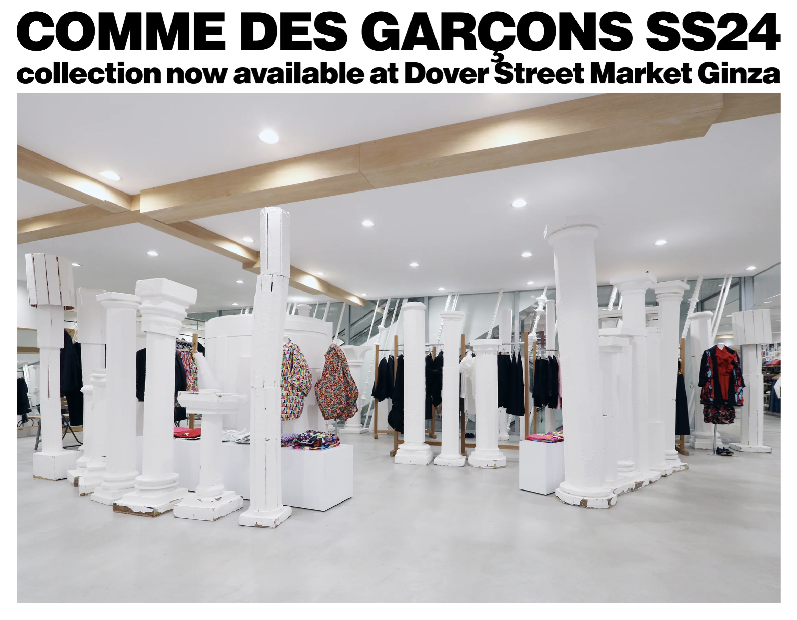
* Ginza 门店

* London 门店

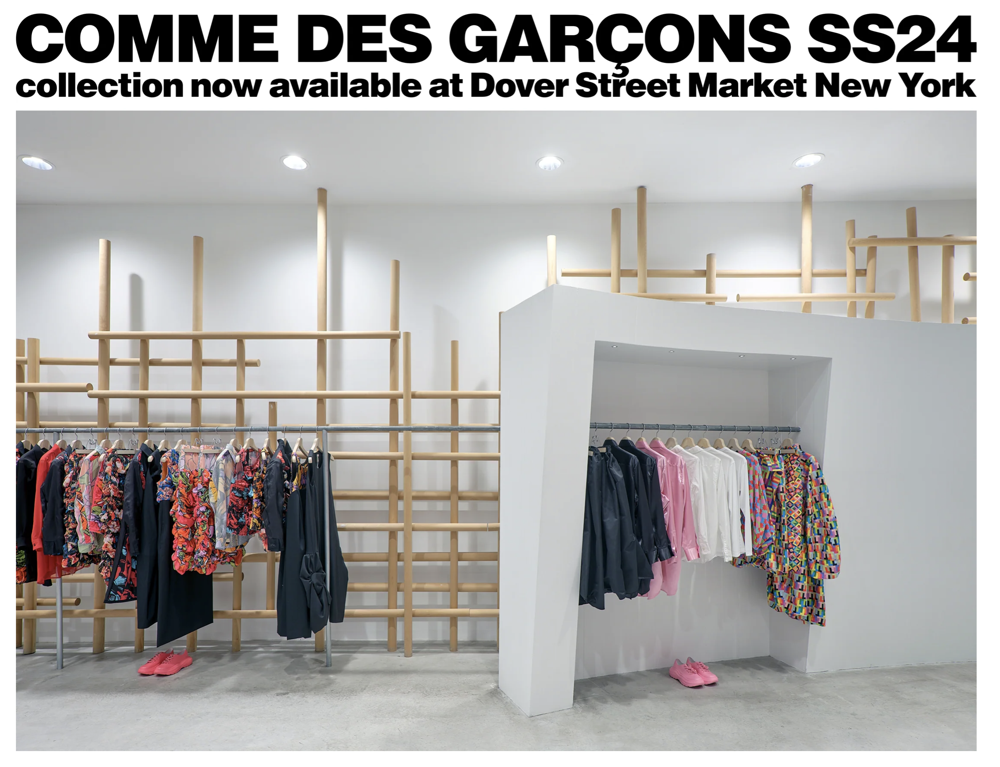
* New York 门店

* Singapore 门店

#### 成功原因 2 - 新媒体线上线下统一运营
##### Ins

* Beijing

* Ginza

* Singapore

* London

##### Latest
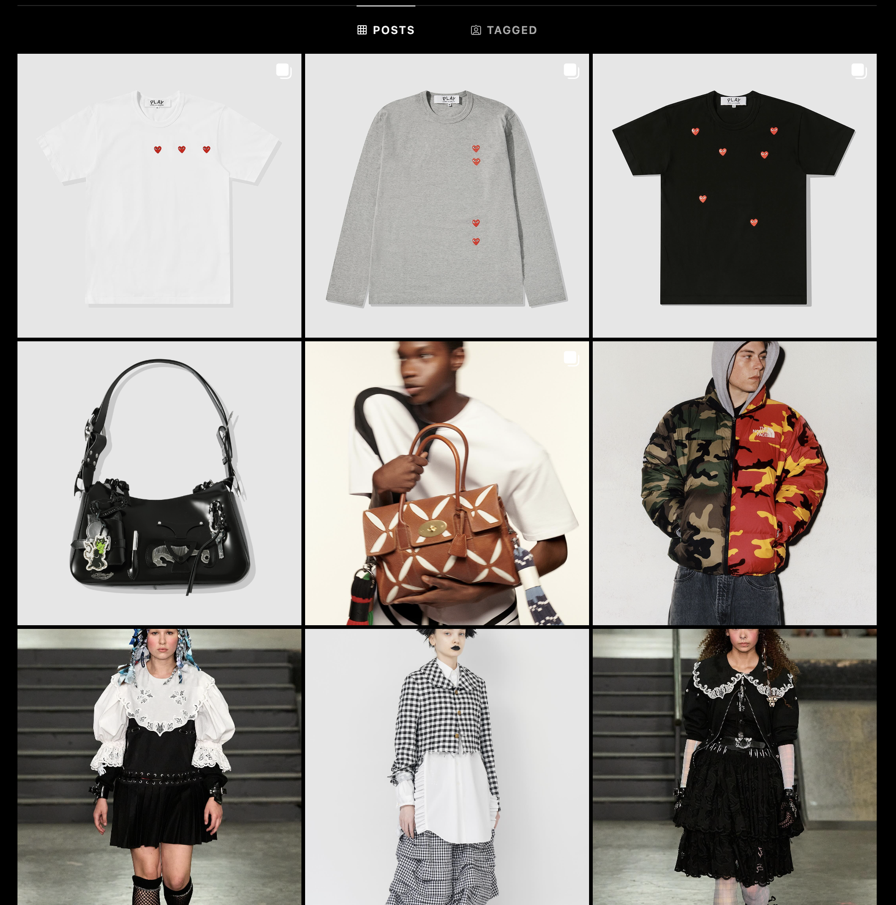
* Beijing

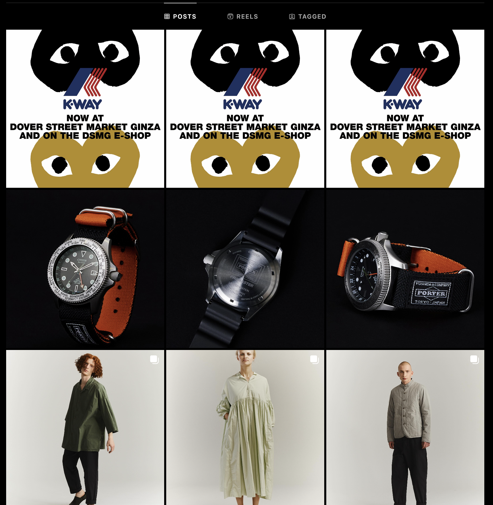
* Ginza

* Singapore

* London

#### 成功原因 3 - 对时尚行业的专家级理解
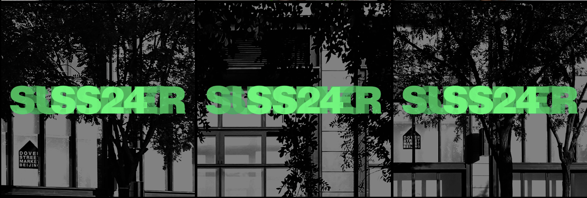
* Refresh bar for new products & service release SS24

#### 成功原因 4 - 广泛且专业的媒体曝光
* [FEBRUARY 23, 2024 EXCLUSIVE: Róisín Pierce Joins Dover Street Market Paris’ Brand Development Roster](https://wwd.com/fashion-news/fashion-features/dover-street-market-paris-roisin-pierce-1236206223/)
* [AUGUST 24, 2023 Carla Sozzani Tapped for Dover Street Market’s Imminent Paris Opening: Sources](https://wwd.com/fashion-news/fashion-scoops/carla-sozzani-dover-street-market-paris-1235773324/)
* [NOVEMBER 30, 2023 EXCLUSIVE: Dover Street Market Teams With Felix Art Fair in L.A. for 2024 Edition, Opening Feb. 28](https://wwd.com/eye/lifestyle/dover-street-market-felix-art-fair-1235964816/)
* [DECEMBER 14, 2023 Suzy Menkes Celebrates Big 8-0 at Dover Street Market London](https://wwd.com/fashion-news/fashion-scoops/suzy-menkes-celebrates-big-8-0-dover-street-market-london-1236076276/)
* [SEPTEMBER 13, 2023 EXCLUSIVE: Zomer Is Dover Street Market Paris’ Latest Find](https://wwd.com/fashion-news/fashion-features/zomer-joins-dover-street-market-paris-fashion-week-showroom-1235803560/)
* [JANUARY 25, 2024 Dover Street Market Fetes Lunar New Year With Shushu/Tong and Bao](https://wwd.com/business-news/retail/dover-street-market-luna-new-year-shushu-tong-bao-1236150998/)
* [MARCH 3, 2021 EXCLUSIVE: Dover Street Market to Mix Culture, Community and Commerce in Paris](https://wwd.com/fashion-news/designer-luxury/dover-street-market-opening-paris-1234749172/)

### 2. Anchoret
#### 成功原因 1 - 

#### 成功原因 2 - 

#### 成功原因 3 - 

#### 成功原因 4 - 

#### 媒体曝光
* [Best Fashion Boutiques in China](https://wwd.com/business-news/retail/7-best-fashion-boutiques-in-china-1235388969/)
* [China’s Concept Store Boom](https://wwd.com/business-news/retail/china-concept-store-boom-1235782645/)

## 我们在路上
* 目前，AI原优舍买手店是

## 时尚科技 - AIGC赋能点
### 1. 时尚设计如服饰，饰品等
* 常用工具
  * [Midjourney](https://www.midjourney.com/home)
  * [Stable Diffusion](https://stability.ai/)
  * [Raspberry](https://www.useraspberry.com/)
  * 妈妈设计
  * Feature: Similar to MJ and SD. The outputs are much more readily manufacturable, appealing and just things that we can start selling right away.
* 核心技术
  
  * Diffusion Models
* 效果展示
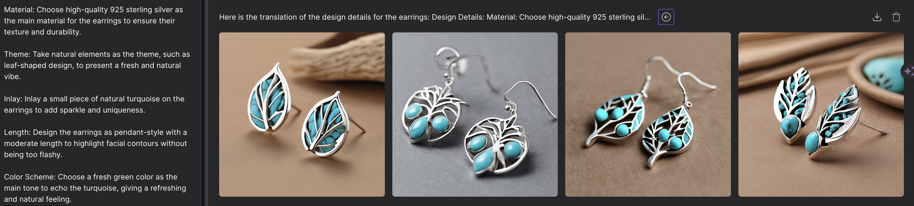
* ai design earring
* designer: AI原优舍

* ai design ring
* designer: AI原优舍

* ai design clothes
* designer: paatiff

### 2. 虚拟试衣，虚拟试饰品等
* 常用工具
  * [OOTDiffusion](https://github.com/weijiang2023/OOTDiffusion)
  * [Google Virtual Tryon](https://blog.google/products/shopping/ai-virtual-try-on-google-shopping/)
  * [妈妈试衣](https://www.tryon.algmon.com/)
* 核心技术
  
  * Mix-and-Match
* 效果展示
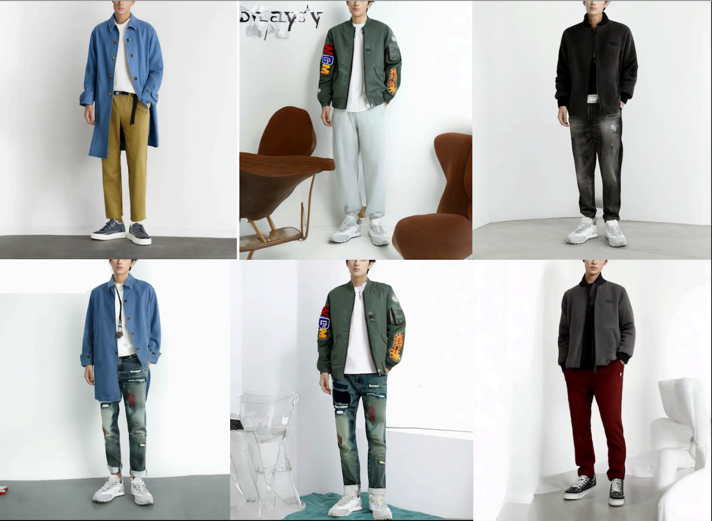
* AI Gen Look for men
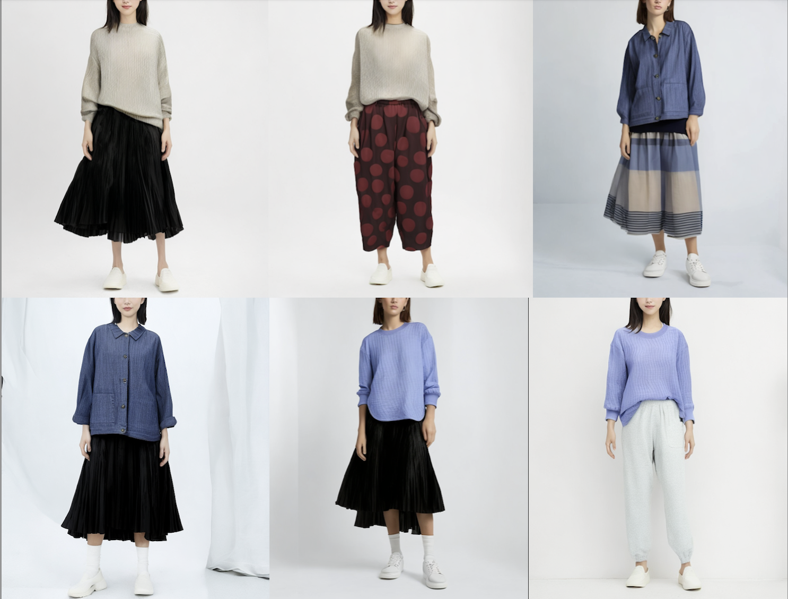
* AI Gen Look for women
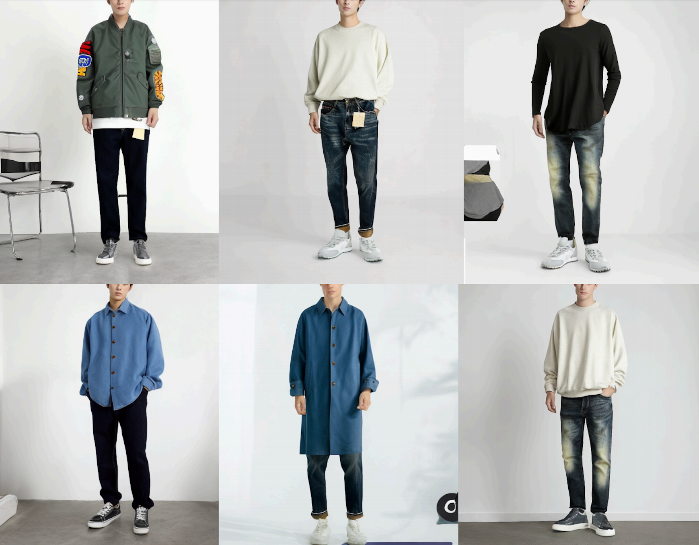
* AI Gen Look for both

### 3. 智能看款
* 常用工具
  * [WWD Runway](https://wwd.com/runway/)
  * [Vouge Runway](https://www.vogue.com/fashion-shows)
  * [妈妈看款](https://www.lookbook.algmon.com/)
* 核心技术
  * 面料，廓形，目标客户等综合认知
* 效果展示

### 4. 智能AI时尚买手
* 常用工具
  * 妈妈时尚买手
* 核心技术
* 效果展示

## 感恩阅读 & 致谢
* 首先，非常感恩您的阅读。
* 作为广州一名时尚买手，我深感社会责任之重，也同时深感时尚科技给社会和经济带来的变革性力量。我们将继续拥抱AIGC，以赋能服装行业为己任和奋斗目标。
* 我是张优玲，业界都称我为小玲买手。

## 参考资料
1. [WWD 深度报道｜中国的买手店升级换代了，买手店销售呢？](https://mp.weixin.qq.com/s/EmcQ8vq3noKWRTLrYY81Nw)
2. [WWD 深度报道｜高端又时髦的买手店，为什么在中国处境艰难？](https://mp.weixin.qq.com/s/qcH1mYN5KEqeE0TbpyN7ng)
3. [WWD The Challenge of Multibrand Boutiques in China](https://wwd.com/feature/retail-the-challenge-multibrand-boutiques-in-china-1203229362/)
4. [WWD Colette Concept Store to Cease Operations in December](https://wwd.com/business-news/retail/colette-concept-store-closure-december-10944299/)
5. [WWD 7 Best Fashion Boutiques in China](https://wwd.com/business-news/retail/7-best-fashion-boutiques-in-china-1235388969/)
6. the state of fashion 2024 by McKinsey & BoF
7. the state of fashion 2023 by McKinsey & BoF
8. the state of fashion 2022 by McKinsey & BoF
9. the state of fashion 2021 by McKinsey & BoF
10. the state of fashion 2020 by McKinsey & BoF
11. the state of fashion 2019 by McKinsey & BoF
12. the state of fashion 2018 by McKinsey & BoF
13. the state of fashion 2017 by McKinsey & BoF
14. [产业洞察 | 中国买手店的老模式新玩法](https://mp.weixin.qq.com/s/QheML8mWWqWjpIT8gquiHw)
15. [商业洞察｜以时装周为世界窗口，如何理解中国时尚产业的独特增长叙事？](https://mp.weixin.qq.com/s/sgNjb6zUctM8v8vneFA6XA)
16. [零售观察｜高端商场为何频频涉足自营买手店？](https://mp.weixin.qq.com/s/vIBwtw8pLvWO16g_7nbayA)
17. [年度回顾：中国买手店能否走出 “爆款制造机” 的困境？](https://mp.weixin.qq.com/s/Xh2Smif307W6wjlzz57xNg)
18. [“暗藏玄机”的社区买手店，为何5年数量激增6倍？](https://mp.weixin.qq.com/s/eSQ-B6nr9r67bmpwRX2WWA)
19. [Joyce 败走，买手店们的下一步是什么？](https://mp.weixin.qq.com/s/xzwjQIoOpH2NZGJeoRdL7A)
20. [为什么全球买手店命运多舛，中国买手店却风生水起？](https://mp.weixin.qq.com/s/XrJTLsz0IHa0dWC7luTIZg)
21. [中国买手店的好时代到来了吗？（上篇）](https://mp.weixin.qq.com/s/-UKtqjJcYpFSupj0rGGiSg)
22. [观点丨当多数实体零售商濒临灭亡之时，Dover Street Market 为何能保持竞争力？](https://mp.weixin.qq.com/s/kCuqYZPUSQpxdjVy35sPIg)
23. [集20+日本品牌的买手店，进门秒变日系萌妹！](https://mp.weixin.qq.com/s/0-wPOi7sIOlak-I6HIyL1A)
24. [中国买手店研究报告](https://mp.weixin.qq.com/s/CsEfnbgXR09wsrJvqzFwGA)
25. [为什么我们需要买手店？](https://mp.weixin.qq.com/s/wDBhXkKtYzvcvMqhtUGveQ)
26. [买手店PlaySERIOUS即将登陆广州太古汇](https://mp.weixin.qq.com/s/YGanuWAVRi5CYyWIypCRfQ)
27. [你的买手店受欢迎吗？看这几点就对了!](https://mp.weixin.qq.com/s/QzxrWj6uQwSxoqVHKEOHzQ)
28. [买手店再袭撑得住吗？](https://mp.weixin.qq.com/s/RgIw6VGeVaFeeeboTsR-aQ)
29. [buyer.Mu|设计师买手店的姻缘](https://mp.weixin.qq.com/s/5WouugAZ8FeQbPsOyN7vuA)
30. [BoF: The Race to Build the Best Generative-AI Platform for Fashion Design](https://www.businessoffashion.com/articles/technology/the-race-to-build-the-best-generative-ai-platform-for-fashion-design/)
31. [BoF: Can AI Carry On a Designer’s Legacy?](https://www.businessoffashion.com/articles/technology/can-ai-carry-on-a-designers-legacy/)
32. [BoF: How Pinterest’s ‘Inclusive AI’ Is Getting Users to Shop](https://www.businessoffashion.com/articles/technology/how-pinterest-uses-ai-to-drive-commerce/)
33. [BoF: How AI Is ‘Amplifying Creativity’ in Fashion](https://www.businessoffashion.com/articles/technology/ai-fashion-london-fashion-week/)
34. [BoF: When Amazon’s New AI Tool Answers Shoppers’ Queries, Who Benefits?](https://www.businessoffashion.com/articles/technology/amazon-ai-tool-rufus-explained/)
35. [BoF: Here Comes the AI Backlash](https://www.businessoffashion.com/articles/technology/here-comes-the-ai-backlash/)
36. [BoF: The Technologies the Retail Industry Is Betting On](https://www.businessoffashion.com/articles/technology/the-technologies-the-retail-industry-is-betting-on/)
37. [BoF: The Best of BoF 2023: The AI Revolution](https://www.businessoffashion.com/articles/technology/best-of-2023-technology-ai-ecommerce-virtual-fashion/)
38. [BoF: The Year Ahead: How Gen AI Is Reshaping Fashion’s Creativity](https://www.businessoffashion.com/articles/technology/the-state-of-fashion-2024-report-generative-ai-artificial-intelligence-technology-creativity/)
39. [BoF: How Fashion Schools Are Tackling AI’s Blind Spots](https://www.businessoffashion.com/articles/technology/fashion-schools-ai-bias-diversity/)
40. [BoF: Google Is Rolling Out New Generative-AI Shopping Features for the Holidays](https://www.businessoffashion.com/articles/technology/google-is-rolling-out-new-generative-ai-shopping-features-for-the-holidays/)
41. [Dover Street Market](https://www.doverstreetmarket.com/)
42. [Dover Street Market Beijing Ins](https://www.instagram.com/doverstreetmarketbeijing)
43. [China’s Cool Young Designers Tap New Routes to Market](https://www.businessoffashion.com/briefings/china/chinese-emerging-brands-new-path/)

## 附：核心买手店信息列表
1. Angle
2. 北京 栋梁
3. Young Simba
4. Triple-Major
5. GCWZ
6. Labelhood
7. LOOKNOW
8. Triple Major
9. 长沙 WSHIEN
10. 上海 Autumn Sonata
11. 成都 肆合Four
12. 北京 SKP Select
13. 北京 Sanlipop
14. 北京 Paint
15. 上海 the Balancing
16. 上海 In the Park
17. 北京 Lane Crawford