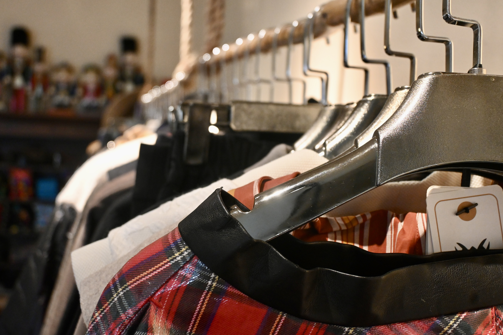
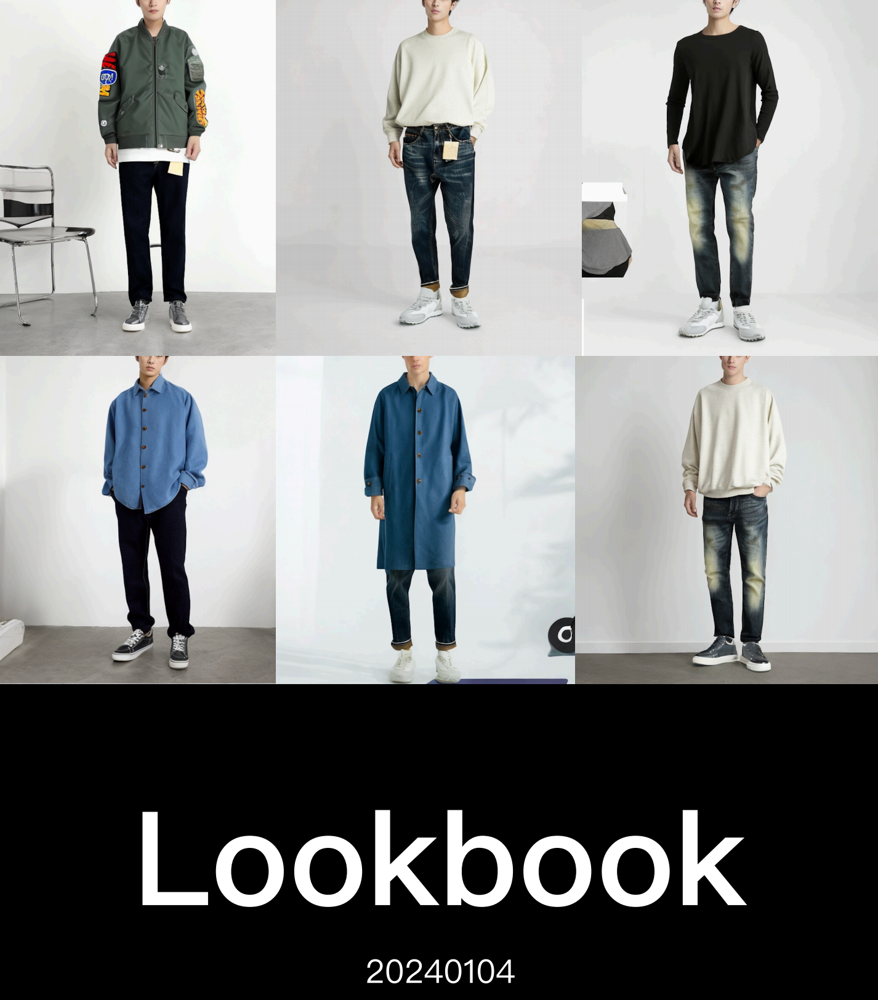

# AI原优舍买手店
## 简介
* AI原优舍是算法妈妈旗下时尚买手店品牌。我们的服饰风格主要是日本小众。我们相信，设计师、品牌、买手三者之间的共存共生关系，勾勒了时尚商贸的本质轮廓。

## 线下
* 我们把整个空间分为3部分，供大家进行选购。

* A区：日本小众男装系列

* B区：日本小众女装系列

* C区：人工智能设计系列

## 线上
### 20240101

### 20240102

### 20240104
