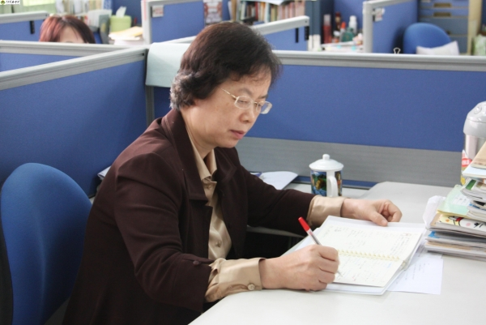

## 总经办
### 江锦培 Jinpei Jiang
#### 简介
* 江锦培先生目前为公司首席执行官，他对数据石油的采购、挖掘及销售等均有丰富业界经验。
* 联系方式：jinpei@suanfamama.com

### 黄为 Wei Huang

#### 简介
* 黄为老师目前为算法妈妈公司监事，她是广东实验中学数学高级教师，享副高职称，广东省特级教师，广东省人民政府督学，广东省名师工作室主持人。她荣获南粤教书育人优秀教师、全国模范教师、全国苏步青数学教育奖、广东省基础教育系统名师称号。她培养广东省数学高考状元数几十人。他之前任职广东实验中学。
* 联系方式：weihuang@suanfamama.com

## AI时尚买手部门
### 张优玲 Youling Zhang
#### 简介
* 公司联合创始人
* 资深AI时尚买手
* AI时尚买手部门部门主管
* 负责公司时尚业务线
* 张优玲女士是一位在业界享有盛名的资深AI时尚买手，她是时尚品牌Men's Club、AI原优舍的创始人和主理人。她出生于1979年，自幼从商。她创立了原优舍商行，这个品牌成为了她的创作舞台，也是她的艺术表达的载体。张优玲女士的设计风格独特和前卫，她常常挑战传统的时尚界观念，打破常规，以非凡的创意和独特的审美风格闻名于世。她的设计充满了对服装结构、形式和材料的探索，常常涉及到不对称、夸张的轮廓和抽象的图案。她善于利用黑色和深色调，突显服装的线条和结构美，同时也常常运用不同材质的拼接和裁剪，创造出独特的视觉效果。除了服装设计，张优玲女士还积极涉足其他领域，例如艺术、家居用品设计等。她的作品常常被认为是艺术与时尚的结合，具有很高的艺术价值和审美感受。她因其在时尚界的杰出贡献，曾多次获得国际时尚界的认可和奖项，她的作品也被收藏于各大艺术博物馆和画廊。她的设计不仅影响了时尚界，也深远地影响了当代艺术和审美观念。
* 联系方式：youling@suanfamama.com

### 刘嘉莉 Jiali Liu
#### 简介
* 高级AI时尚买手
* 负责公司整体销售 & 人事
* 联系方式：jiali@suanfamama.com

### 梁心怡 Xinyi Liang
#### 简介
* 初级AI时尚买手
* 在资深买手指导下负责公司时尚业务线
* 心怡同学是广东海洋大学服装设计与工程的优秀毕业生，专业排名前10%。她学习能力高，性格活泼开朗，专业能力扎实。
* 联系方式：xinyi@suanfamama.com

### 陈轶恒 Yiheng Chen
#### 简介
* 中级AI时尚买手
* 在资深买手指导下负责公司时尚业务线
* 轶恒是一位有经验新媒体广告人，同时是一位有经验饰品设计师，他的设计风格偏简约与典雅。
* 联系方式：yiheng@suanfamama.com

### 叶达丰 Dafeng Ye
#### 简介
* 中级AI时尚买手
* 在资深买手指导下负责公司时尚业务线
* 小叶致力于成为一位优秀服装人，他本科毕业于广州美术学院，由其擅长材料的运用及再造、面料图案设计、植物染、羊毛毡等技术。
* 联系方式：xiaoye@suanfamama.com

### 张丹丹 Dandan Zhang
#### 简介
* 初级AI时尚买手
* 在资深买手指导下负责公司时尚业务线
* 丹丹是一名在校大学生，专业是视觉传递。她对时尚，新媒体及拍摄有独特的敏感度。
* 联系方式：dandan@suanfamama.com

## 人工智能部门
### 江纬博士 Wei Jiang

#### 简介
* 公司创始人
* 公司人工智能部门主管
* 负责人工智能业务线
* 大数据 & 人工智能专家
* 华南理工大学新闻与传播（认知计算广告方向）博士
* 江纬，他是一个土生土长的广州人，粤港澳AI智库特聘专家，互联网连续创业者，专注于大数据与人工智能领域。他本科计算机毕业于广东工业大学，硕士计算机毕业于南加州大学。他曾服务于Google，软通等知名企业，积累了丰富的业界经验。他目前是算法妈妈创始人，使命是使用人工智能赋能教培与时尚行业，目前负责公司产品和技术团队；

#### 媒体曝光（2023年后）
* 2024年3月，华南理工大学新闻与传播学院《AI时尚买手》客座课程《人工智能行业发展趋势》和《人工智能赋能服装行业》
* 2024年网讯公司年会主题分享，分享题目《大模型发展趋势与应用》
* 2023年《米雪爱科技》主题分享，分享题目《AI+教育会让人更聪明还是更懒，如何实现“多向奔赴”？》
* 2023年云商会《数说AI》第二期主题分享，分享题目《AI赋能服饰行业中的困惑与破局》
* 2023年粤港澳AI智库成立大会主题分享，分享题目《AI赋能服装行业》

#### 现个人社会责任与组织
* 中国CCF计算机学会会员

#### 业界经验
* 2022 - 现在，连续创业者，算法妈妈创始人及CEO
* 2021 - 2022，软通动力数字人，人工智能部门总监
* 2019 - 2021，云润大数据，人工智能部门总监
* 2017 - 2019，蓝盾信息安全，人工智能部门总监
* 2015 - 2017，Google，软件工程师
* 2011 - 2015，纽约大学，Tandon School of Engineering，大数据如搜索引擎，研究员

#### 教育背景
* 2009 - 2011，南加州大学，Viterbi School of Engineering，计算机科学与技术，硕士
* 2005 - 2009， 广东工业大学，计算机学院，计算机科学与技术，本科

#### 目前项目
* 算法妈妈 - 智能体系列
* 算法妈妈 - AIGC认知计算广告平台

#### 过去项目
* 算法妈妈 - 虚拟试衣
* 算法妈妈 - 设计
* 软通动力 - 2D逼真数字人产品及服务；
* 云润大数据 - 智能舆情分析模块；
* 蓝盾信息安全 - 人工智能防火墙；
* Google - 搜索引擎（海量数据索引及存取优化）；
* 纽约大学工程学院 - 分层索引机制及基于用户查询的静态剪枝算法优化；

#### 联系方式
* 学术界（邮箱）：wj382@nyu.edu
* 工业界（邮箱）：wei@suanfamama.com

### 严咏楠 Yongnan Yan
* AI工程师 & 总经理助理（全栈）
* 全栈模块设计及实现
* 联系方式：yongnan@suanfamama.com

### 彭彬 Bin Peng
* AI工程师（全栈）
* 全栈模块设计及实现
* 联系方式：bin@suanfamama.com

### 巫乐天 Letian Wu
* AI工程师（全栈）
* 全栈模块设计及实现
* 联系方式：letian@suanfamama.com

### 戚昊羽 Haoyu Qi
* AI工程师（算法）
* 算法模块设计及实现
* 联系方式：haoyu@suanfamama.com

## 公司顾问团队
### 余永权教授 Yongquan Yu
#### 简介
* 人工智能方向
* 余永权，二级教授，博士生导师，原广东工业大学计算机学院院长。
* 1970年开始在广东工业大学任教，曾任GDUT Motorola MCU 应用研究中心主任。GDUT Microchip联合实验室主任。广东省人民政府参事，广东省政协委员。1970年，参加广东省第一台中型计算机研制。1993 年至1994年，被国家教委选送到加拿大多伦多大学研究智能系统。主持科研项目等100 多项，是我国智能家用电器首创发明人，有十几项科研成果被万宝、容声、科龙等著名企业大规模产业化生产，创造数以亿计的经济效益。被评为广州市科技创新有功人员。长期从事计算机、自动化及人工智能教学及科研，是我国研究模糊芯片、磁泡存储器的少数人员。发表论文100余篇，拥有国家专利14件，出版专著、教材17部，获部、市级奖10多项，被选为广东省计算机学会副理事长、广州智能工程研究会副会长、广东省老科协副会长。
* 联系方式：yongquan@suanfamama.com

### 马克 Mark
#### 简介
* 智能教培方向
* Mark毕业于香港大学经济学，获本科学位。他拥有20年商业及技术咨询经验，在加入算法妈妈前曾在麦肯锡等著名全球性管理咨询公司任高层。他目前专注于时尚科技领域。在过去的两个十年里，他一直致力于帮助时尚品牌和公司在商业和技术层面取得成功。他对时尚行业的深入了解和广泛的经验使算法妈妈团队能够提供全面的咨询服务，涵盖市场趋势分析、品牌定位、销售策略、供应链优化、数字化转型以及技术解决方案等方面。
* Mark擅长将商业策略与技术创新相结合，帮助客户实现业务增长和效率提升。他熟悉时尚行业的各个环节，包括设计、生产、销售和营销，能够为客户提供量身定制的解决方案，帮助他们在竞争激烈的市场中脱颖而出。作为一名经验丰富的企业顾问，他注重与客户的合作，始终以客户的需求和目标为导向。他同时具备优秀的沟通技巧和团队合作能力，能够与各个层面的人员进行有效的沟通和协作，确保项目顺利实施并取得成功。
* 联系方式：mark@suanfamama.com

### 胡兆基 Zhaoji Hu
#### 简介
* 认知计算广告方向
* 资深媒体销售与管理专家
* 皓邻科技合伙人、营销副总
* 拥有20年深厚行业背景，涉足多维度广告领域，包括但不限于社区、电梯媒体、公交视觉展示、直播营销以及在线外卖平台广告。精通户外广告、数字程序化购买（DSP）、多频道网络（MCN）及直播销售策略，具备全面的操作流程知识与卓越的团队管理能力。在20年的职业生涯中，特别注重于销售团队的建设与管理，累计15年经验，专注于打造高绩效团队。服务对象聚焦于快速消费品（FMCG）与汽车制造业，为知名品牌制定并执行精准市场策略，成就显著业绩。
* 联系方式：zhaoji@suanfamama.com