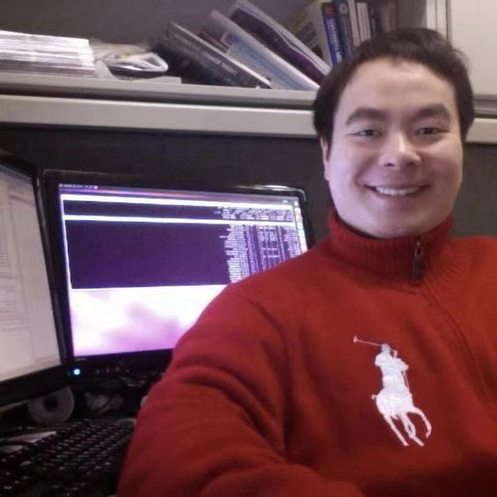

## 江纬 Wei Jiang

### 简介
* 江纬，他是一个土生土长的广州人，粤港澳AI智库特聘专家，互联网连续创业者，专注于大数据与人工智能领域。他的教育背景丰富，本科计算机毕业于广东工业大学，硕士计算机毕业于南加州大学及在纽约大学攻读博士。他曾服务于Google，软通等知名企业，积累了丰富的业界经验。他目前是算法妈妈创始人，使命是使用人工智能赋能教培与时尚行业，目前负责公司产品和技术团队；

### 2023年后媒体曝光
* 2024年网讯公司年会主题分享，分享题目《大模型发展趋势与应用》
* 2023年《米雪爱科技》主题分享，分享题目《AI+教育会让人更聪明还是更懒，如何实现“多向奔赴”？》
* 2023年云商会《数说AI》第二期主题分享，分享题目《AI赋能服饰行业中的困惑与破局》
* 2023年粤港澳AI智库成立大会主题分享，分享题目《AI赋能服装行业》

### 个人社会责任与组织
* 粤港澳AI智库特聘专家
* TGO鲲鹏会成员
* 中国CCF计算机学会会员

### 业界经验
* 2022 - 现在，连续创业者，算法妈妈创始人，专注于使用人工智能赋能教培与时尚行业；
* 2011 - 2022，软通动力，人工智能部门总监，专注于数字人核心技术研发与商业项目合作；
* 2019 - 2011，云润大数据，人工智能部门总监，专注于使用人工智能赋能舆情分析行业；
* 2017 - 2019，蓝盾信息安全，人工智能部门总监，专注于使用人工智能赋能信息安全行业，如AI防火墙产品等；
* 2015 - 2017，Google，软件工程师，专注于海量数据分析，索引及存取优化，如Google搜索引擎；

### 教育背景
* 2011 - 2015，纽约大学，Tandon School of Engineering，大数据如搜索引擎，博士候选人
* 2009 - 2011，南加州大学，Viterbi School of Engineering，计算机科学与技术，硕士
* 2005 - 2009， 广东工业大学，计算机学院，计算机科学与技术，本科

### 工程项目
* [Algmon Company Website](https://github.com/algmon/algmon-company-website)
* [Algmon Chatbot](https://github.com/algmon/algmon-llm-wechat-template)
* [Algmon KB](https://github.com/weijiang2023/algmon-kb)
* [Algmon Tryon Core Tech](https://github.com/weijiang2023/OOTDiffusion)

### 研究项目
* 

### 联系方式
* 学术（邮箱）：wj382@nyu.edu
* 商业（邮箱）：wei@algmon.com
* 微信：

