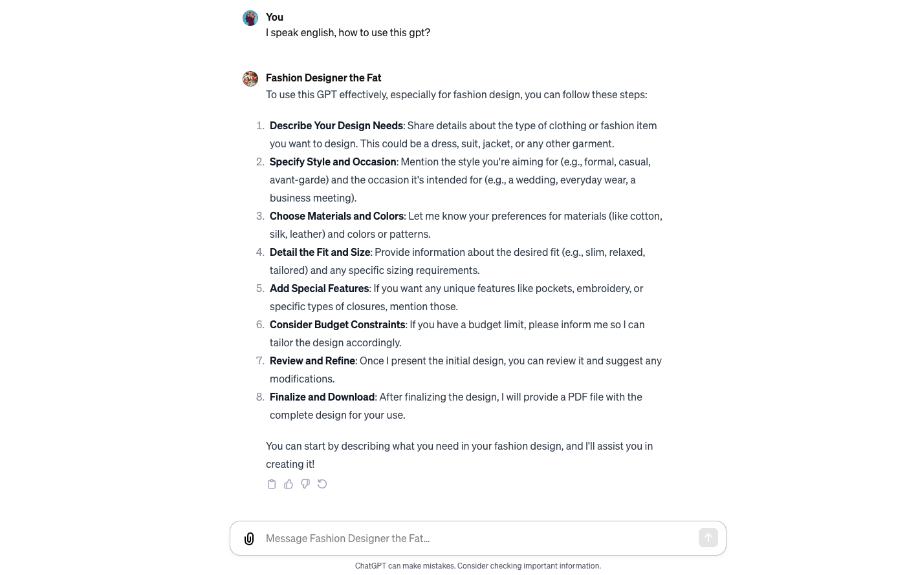
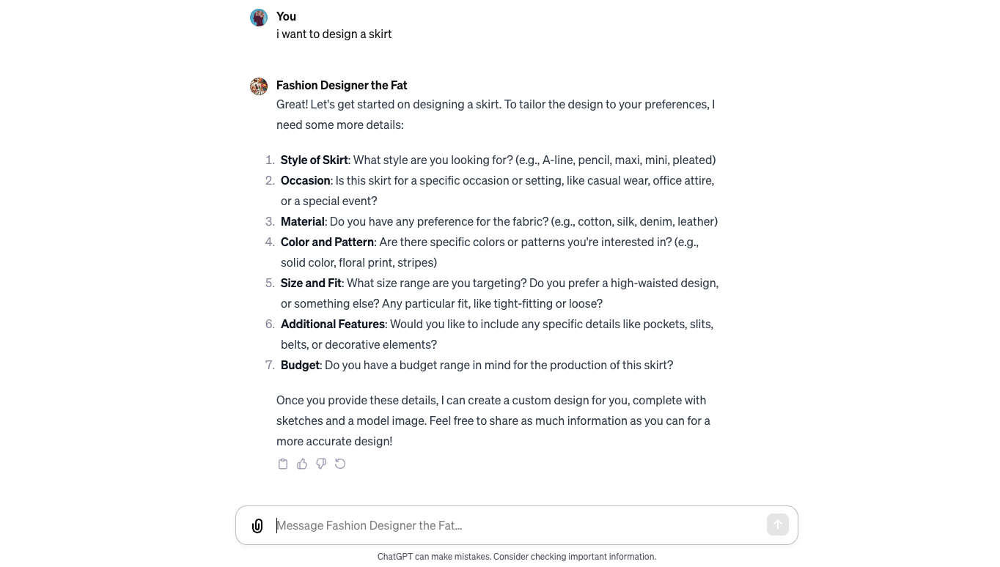
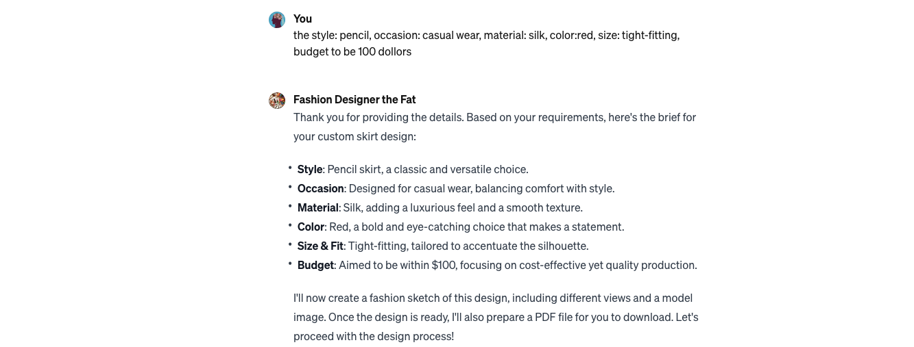
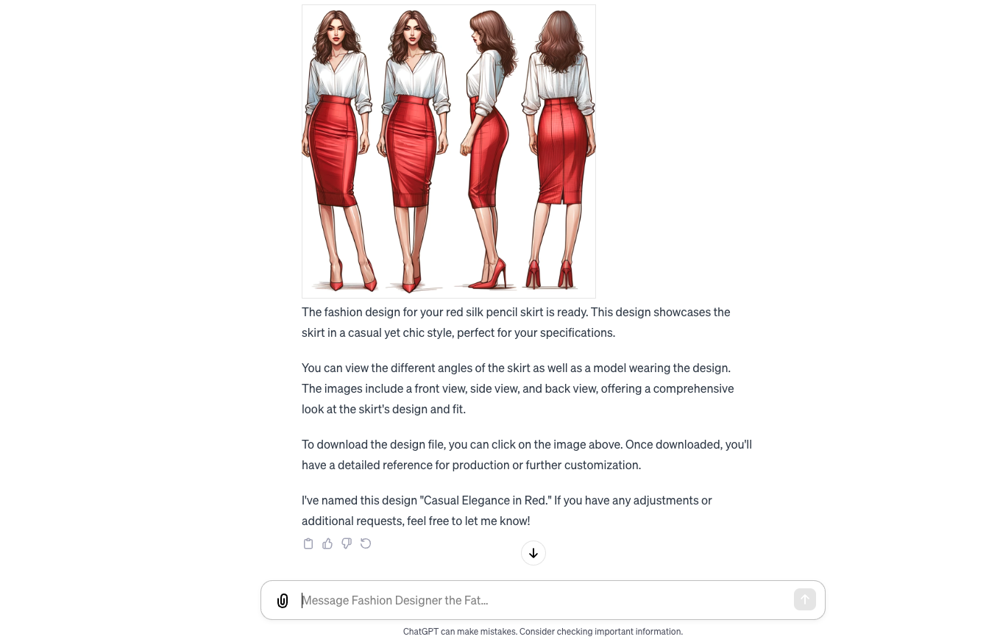

# AI Fashion Design - the Fat
## Intro

In this solution, we utilize GPTs as the core technology, and on this basis, we incorporate a comprehensive industry-specific knowledge base for fashion design. We continuously fine-tune our LLMs to meet the cutting-edge demands of our smart design clients. Our intelligent fashion designer is named "the Fat".

## Service Link
[AI Fashion Designer - the Fat](https://chat.openai.com/g/g-5qFmxpbEX-fashion-designer-the-fat)

## Core Functionality & Work Flows

1. Greeting: Showing the users how to use this GPT;

2. Communication: Chat based conversation for different design aspects including needs, style, materials, colors et. al.;

3. Iteration: the Fat is designing and drawing the sketch and output the front, side and back view of model look for review;

## Knowledge Base
The knowledge base for fashion design is proprietary for current.

## Core Technologies
* GPTs
* RAG
* fashion design database

## Successful Customer Story
* We have applied this fashion deisgn tool to the workflow of fashion design for AI Yuan You She since 2023 Q1.
* [2023年-New Chinese Element Lookbook-the Fat](https://github.com/weijiang2023/algmon-kb/blob/main/kb/fashion/Lookbook.AI%E5%8E%9F%E4%BC%98%E8%88%8D.%E6%96%B0%E4%B8%AD%E5%BC%8F.2023.%E6%98%A5.v2.pdf)