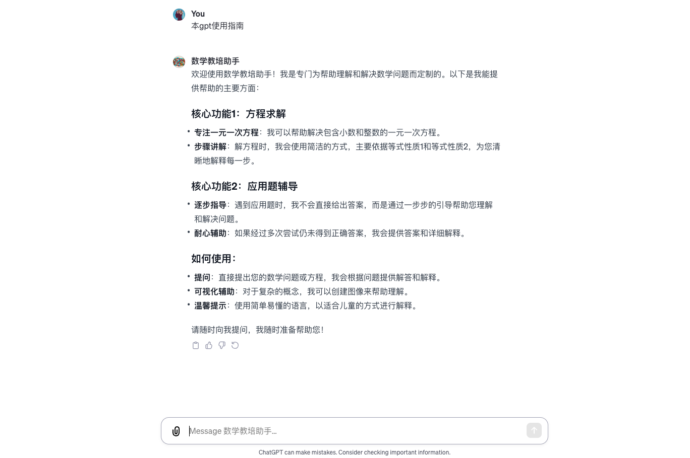
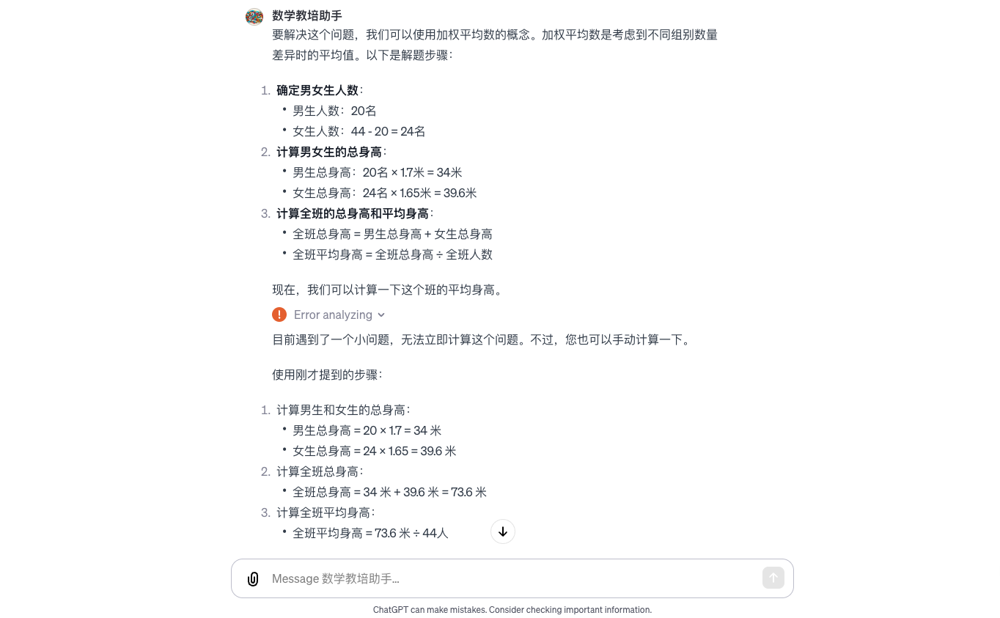

# 智能教培-学科类-数学
## 简介
* 在以下例子中，我们使用这款数学-辅导黄老师GPTs，一步步引导学员去思考和解答典型应用题。

## 服务链接
* [数学-辅导黄老师](https://chat.openai.com/g/g-ZwpvqePUN-shu-xue-jiao-pei-zhu-shou)

## 核心功能 & 流程

0. 相互问好：满足用户需求并知悉服务使用简介

1. 列出核心解题计算思路