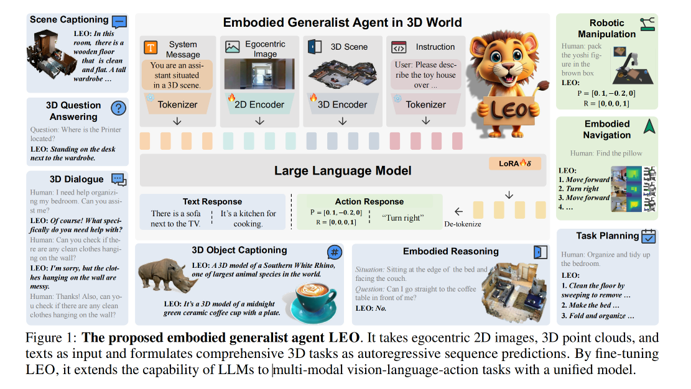

# 2023-11-26论文解读

## Paper Title
[An Embodied Generalist Agent in 3D World](https://github.com/weijiang2023/Suanfamama-kb/blob/main/kb/computer.science/AGENT.2311.12871.v1.pdf)

#### Authors
Jiangyong Huang et. al.

#### Affiliations
BIGAI et. al

#### Date
Nov 18, 2023

#### 5Ws

##### 1. What is the problem?
The paper introduces AGENT (A Generalist Agent), a system designed to interact with and act within arbitrary text-based environments. The problem it addresses is the challenge of developing a generalist agent capable of understanding and operating in a wide range of text-based interfaces, including websites, applications, and command lines.

##### 2. Why is the problem IMPORTANT?
This problem is significant because it represents a step towards creating more versatile and adaptable AI systems. Current AI models often struggle with tasks outside their specific training domains. AGENT's ability to interact with diverse text-based environments suggests a path towards more flexible and general AI systems.

##### 3. Why is the problem DIFFICULT?
The difficulty lies in the inherent complexity and variability of text-based interfaces. These interfaces can vary greatly in their structure, commands, and expected actions. Designing an AI system that can understand and effectively operate across such a diverse range of environments is a challenging task.

##### 4. What are the OLD techniques?
Previous techniques in this domain typically focused on training AI models on specific tasks or environments. This specialization meant that the models were not adaptable to new or different interfaces without additional training.

##### 5. Compared to the old technique, what are the Advantages and Disadvantages of the new ones?
Advantages:
* AGENT demonstrates greater versatility and adaptability across different text-based environments.
* It can perform well in environments it was not explicitly trained on, showcasing a higher degree of generalization.

Disadvantages:
* The paper might highlight challenges in consistently maintaining high performance across all types of environments.
* There could be limitations in understanding context or user intent in more complex or nuanced interactions.

Please note that this analysis is based on the contents of the paper as provided in my knowledge source. If there are specific sections or details you are interested in, feel free to ask for more focused information.
