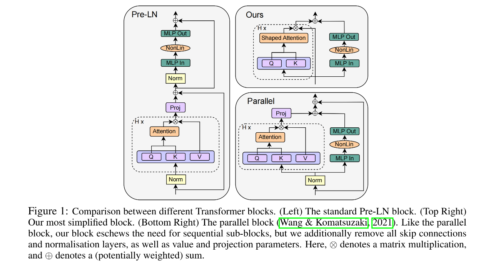

# 2023-11-28论文解读

## Paper Title
[Simplifying Transformer Blocks](https://github.com/weijiang2023/algmon-kb/blob/main/kb/computer.science/TRANSFORMER.2311.01906.pdf)

#### Authors
Bobby He & Thomas Hofmann

#### Affiliations
Department of Computer Science, ETH Zurich

#### Date
Nov 3, 2023

#### 5Ws
The paper "Simplifying Transformer Blocks" addresses the complexity of standard transformer blocks used in deep learning architectures. These blocks typically combine attention and MLP sub-blocks with skip connections and normalization layers in precise arrangements, resulting in complex and sometimes brittle architectures. The paper's primary focus is on whether these standard transformer blocks can be simplified without compromising training speed and performance.

##### 1. What is the problem?
* The paper tackles the complexity of standard transformer blocks, which are integral to many deep learning successes.
* It questions whether components like skip connections, projection/value matrices, sequential sub-blocks, and normalization layers are necessary for effective training and performance​​.

##### 2. Why is the problem important?
* The complexity of neural network architectures, particularly transformer blocks, poses challenges in understanding their training dynamics and the roles of various components.
* Simplifying these architectures can bridge the gap between theoretical deep learning models and those used in practice, and reduce training and deployment costs of large transformer models​​.

##### 3. Why is the problem difficult?
* Understanding and modifying the intricate components of transformer blocks without affecting their training speed or ability to learn effectively is challenging.
* Prior attempts to simplify these blocks, such as by removing skip connections or normalization layers, resulted in reduced convergence speeds​​.

##### 4. What are the old techniques?
* Traditional transformer blocks (e.g., Pre-LN block) include multiple components like multi-head attention (MHA), normalization layers, and skip connections for each sub-block. These blocks are stacked to create deep transformer architectures​​.
* These components are believed to be critical for efficient learning and performance in complex tasks.

##### 5. Advantages and disadvantages of the new techniques?
The new approach involves removing or simplifying components like skip connections, value and projection parameters, and normalization layers.

###### Advantages:
* Simplified models match or even exceed the training speed and performance of standard transformers.
* They result in a 15% faster training throughput and use 15% fewer parameters.
* Simplified models are effective across various architectures, datasets, and tasks, including BERT models for language tasks.
* Efficiency gains with reduced parameter count and faster training speeds​​.

###### Disadvantages:
* There may be slight degradation in training speed per iteration in some cases​​.
* Some components, like normalization layers, might still offer benefits not fully captured by the simplifications​​.
* The simplifications were primarily tested on models with 100-300M parameters, and their effectiveness on larger scales remains to be fully explored​​.

##### 6. Conclusion
* The paper demonstrates that it's possible to simplify standard transformer blocks significantly without losing training efficiency or performance.
* These simplifications could lead to more straightforward, cost-effective architectures in practical applications, narrowing the gap between theoretical and practical models in deep learning​​.

Overall, the paper provides a compelling argument and evidence for simplifying transformer blocks, showing potential for significant improvements in the efficiency of deep learning models.